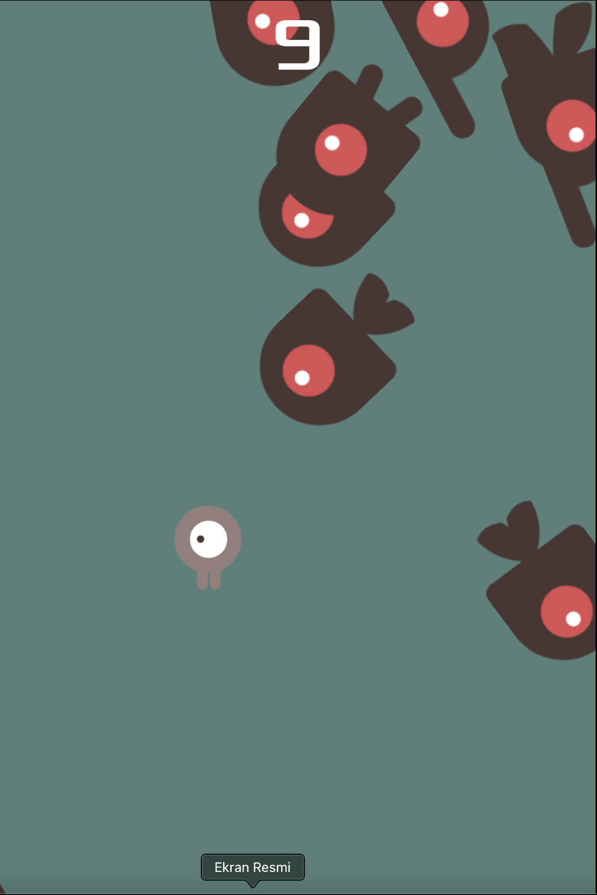

# Dodge the Creeps

This is a simple 2D game made with Godot Engine as a part of the "First 2D Game Tutorial". In this game, the player must avoid getting hit by the creeps for as long as possible.

## Table of Contents
- [Game Description](#game-description)
- [Screenshots](#screenshots)
- [Installation](#installation)
- [How to Play](#how-to-play)
- [Contributing](#contributing)
- [License](#license)

## Game Description
"Dodge the Creeps" is a 2D action game where the player controls a character that must dodge incoming enemies (creeps) that spawn from the edges of the screen. The goal is to survive as long as possible while avoiding the creeps.

## Screenshots




## Installation

1. **Clone the repository:**
    ```sh
    git clone https://github.com/yourusername/dodge-the-creeps.git
    ```

2. **Navigate to the project directory:**
    ```sh
    cd dodge-the-creeps
    ```

3. **Open the project in Godot Engine:**
    - Launch Godot Engine.
    - Click on the "Import" button.
    - Select the `project.godot` file located in the project directory.

## How to Play

1. **Start the game:**
    - Click the "Play" button in the main menu.

2. **Controls:**
    - **Arrow Keys**: Move the player character up, down, left, or right.
    - **Escape**: Pause the game.

3. **Objective:**
    - Avoid the creeps for as long as possible.
    - Your score increases over time based on how long you survive.

4. **Game Over:**
    - If a creep hits you, the game is over, and your score is displayed.

## Contributing
Contributions are welcome! If you'd like to contribute, please follow these steps:

1. **Fork the repository.**
2. **Create a new branch.**
    ```sh
    git checkout -b my-feature-branch
    ```
3. **Make your changes and commit them.**
    ```sh
    git commit -m "Add some feature"
    ```
4. **Push to the branch.**
    ```sh
    git push origin my-feature-branch
    ```
5. **Create a new Pull Request.**

## Credits
- **Tutorial:** Godot's First 2D Game Tutorial
- **Artwork:** Provided by Godot tutorial resources
- **Sound Effects:** Provided by Godot tutorial resources

---

Feel free to customize this README file as needed. Happy dodging!
